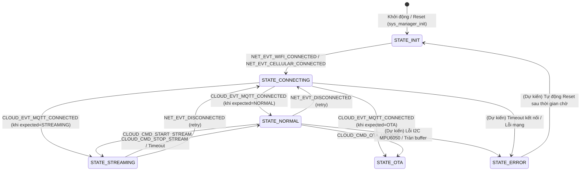

# 🧠 Component: sys_manager (System Finite State Machine)

> **Cập nhật cuối (Timestamp):** 2026-06-30
> **Trạng thái:** Hoạt động ổn định (Phase 2 Gating & Recovery)

---

## 1. PUBLIC API & VÍ DỤ TÍCH HỢP

Các hàm công bố trong [sys_manager.h](include/sys_manager.h):

### 1.1 Khởi tạo FSM
```c
void sys_manager_init(void);
```
Hàm này thực hiện ba việc:
*   Khởi tạo Default Event Loop của ESP-IDF (bỏ qua nếu loop đã tồn tại — `ESP_ERR_INVALID_STATE`).
*   **Tự đăng ký handler nội bộ** (`sys_manager_event_handler`) cho `NET_EVENT` và `CLOUD_EVENT` (với `ESP_EVENT_ANY_ID`). Nhờ vậy `sys_manager` **tự động chuyển trạng thái** theo các event mạng/cloud nhận được mà không cần component khác gọi `sys_manager_set_state` thủ công.
*   Đặt FSM về trạng thái `STATE_INIT`.

### 1.2 Lấy và Thiết lập Trạng thái FSM
```c
system_state_t sys_manager_get_state(void);
void sys_manager_set_state(system_state_t new_state);
```
*   `sys_manager_set_state` ghi log chuyển đổi trạng thái dưới dạng **giá trị số nguyên của enum**: `FSM State Transition: %d -> %d` (ví dụ `0 -> 1`), **không** in tên trạng thái dạng chữ. Sau đó cập nhật trạng thái mới. Nếu trạng thái mới trùng trạng thái hiện tại, hàm trả về ngay (không log, tránh nhiễu).
*   Khi chuyển trạng thái từ `STATE_STREAMING` sang bất kỳ trạng thái nào khác, bộ định thời tự động dừng stream (`stream_timeout_timer`) sẽ tự động được dừng lại.
*   Khi chuyển trạng thái sang `STATE_STREAMING`, hệ thống tự động khởi chạy bộ định thời với chu kỳ lấy từ `svc_cloud_get_stream_timeout()`. Khi hết giờ, callback sẽ tự động dừng stream và đưa hệ thống về `STATE_NORMAL` (chống cạn kiệt pin thiết bị).

### 1.3 Cờ truyền thông khẩn cấp (Comms-Critical Flag)
```c
void sys_manager_bump_comms_critical(uint32_t ms);
bool sys_manager_is_comms_critical(void);
```
*   **Mục đích**: Bảo vệ kết nối vô tuyến không bị gián đoạn do đo RSSI (D-022). Khi module A7680C đo RSSI, nó phải tạm thoát PPP (đứt MQTT socket 15-20s). Để tránh ngắt kết nối lúc đang xác nhận té ngã (pha CONFIRMING của `svc_ai`) hoặc vừa phát alert ngã (pha cooldown của `svc_cloud`), cờ `comms-critical` được dựng lên.
*   `sys_manager_bump_comms_critical(ms)`: Gia hạn cửa sổ comms-critical thêm `ms` milli-giây kể từ lúc gọi. Hàm sử dụng cơ chế so sánh mức deadline lớn nhất (`new_deadline > s_comms_critical_until_us`) để tránh xung đột ghi đè giữa các service khác nhau (monotonic expiry).
*   `sys_manager_is_comms_critical()`: Cho phép dịch vụ mạng (`svc_network`) kiểm tra trước khi thoát PPP thực hiện lệnh đo RSSI. Nếu hàm trả về `true`, tiến trình đo RSSI sẽ tạm hoãn.

### 1.4 Ví dụ: Đăng ký lắng nghe sự kiện
```c
static void network_event_handler(void* arg, esp_event_base_t event_base, int32_t event_id, void* event_data) {
    if (event_base == NET_EVENT && event_id == NET_EVT_WIFI_CONNECTED) {
        ESP_LOGI("APP", "Mạng đã kết nối. Cập nhật FSM sang CONNECTING...");
        sys_manager_set_state(STATE_CONNECTING);
    }
}
// Đăng ký handler
esp_event_handler_register(NET_EVENT, NET_EVT_WIFI_CONNECTED, &network_event_handler, NULL);
```

### 1.5 Ví dụ: Phát đi một sự kiện khi xử lý thành công
```c
// Khi WiFi kết nối thành công trong svc_network
esp_event_post(NET_EVENT, NET_EVT_WIFI_CONNECTED, NULL, 0, portMAX_DELAY);
```

---

## 2. Mục đích (Purpose / Why)
Hạt nhân điều phối trung tâm của toàn bộ thiết bị. Quản lý Máy trạng thái hữu hạn (FSM) và phân phối các sự kiện (Event Loop) giữa các dịch vụ.
`sys_manager` sinh ra để giải quyết vấn đề **khớp nối lỏng (Loose Coupling)** giữa các component. Thay vì các service gọi trực tiếp hàm của nhau (gây phụ thuộc chéo), các service sẽ giao tiếp bất đồng bộ qua **Default Event Loop** của ESP-IDF do `sys_manager` cấu hình.

## 3. Cơ chế hoạt động (How it works): Đặc Tả Máy Trạng Thái (FSM)
Hệ thống di chuyển qua các trạng thái sau tùy thuộc vào điều kiện ngoại vi và kết nối mạng:

| Trạng thái | Ý nghĩa |
| :--- | :--- |
| **`STATE_INIT`** | Khởi tạo phần cứng (I2C, GPIO, NVS, bộ lọc). Đây là trạng thái mặc định lúc khởi động. |
| **`STATE_CONNECTING`** | Dịch vụ mạng đang cố gắng bắt sóng WiFi / kết nối LTE và thiết lập kết nối tới MQTT Broker. |
| **`STATE_NORMAL`** | Hệ thống hoạt động bình thường, đo lường cảm biến IMU nội bộ, chạy thuật toán đếm bước chân cục bộ, **không** truyền dữ liệu thô liên tục (tiết kiệm pin). |
| **`STATE_STREAMING`** | Chế độ truyền dữ liệu thô (Phase 1 Data Collection). Dữ liệu 100Hz từ IMU được gom nhóm (Batch) và gửi liên tục qua MQTT. |
| **`STATE_OTA`** | Đang tiến hành cập nhật chương trình từ xa thông qua mạng. |
| **`STATE_ERROR`** | Phát hiện lỗi phần cứng nghiêm trọng hoặc mất kết nối quá lâu. Thiết bị phát tín hiệu cảnh báo hoặc tự động khởi động lại (Reboot). |

### 3.1 Sơ đồ chuyển trạng thái (State Transition Diagram)
Sơ đồ dưới đây phân biệt rõ **(A) các cạnh đã hiện thực trong code** (`sys_manager_event_handler`) và **(B) các cạnh còn ở dạng kế hoạch (dự kiến)** chưa được code xử lý.



### 3.2 Ma trận hoạt động của Service theo State (FSM Gating)
Để tối ưu CPU và tránh các cảnh báo ảo/hành vi sai thiết kế, các chức năng của các Service được phân luồng (gating) nghiêm ngặt dựa trên FSM state hiện tại của hệ thống (xem quyết định [D-024](file:///d:/datn/datn_agent_skills/project_setup/architecture/DECISIONS.md#L43-L47)):

| Hoạt động | STATE_INIT | STATE_CONNECTING | STATE_NORMAL | STATE_STREAMING | STATE_OTA |
|---|:---:|:---:|:---:|:---:|:---:|
| **Drain FIFO** (luôn đọc MPU6050 chống tràn) | ✓ | ✓ | ✓ | ✓ | ✓ |
| **Kalman / Normalize** (lọc nhiễu & scale dữ liệu) | – | – | ✓ | ✓ | – |
| **AI Inference** (chạy HAR + nhận diện té ngã) | – | – | ✓ (Production) | – | – |
| **Pedometer / Impact / Roll** (đếm bước & va chạm) | – | – | ✓ | – | – |
| **Telemetry status** (gửi cập nhật pin/bước chân) | – | – | ✓ | – | – |
| **Publish IMU Stream** (gửi batch IMU raw lên cloud) | – | – | – | ✓ (Data collection) | – |
| **RSSI update** (đo cường độ tín hiệu 4G) | – | – | ✓ | – | – |
| **Alert** (gửi khẩn cấp khi ngã) | – | – | ✓ | – | – |

*Chi tiết:* Ở `STATE_STREAMING` (chế độ thu thập dataset), hệ thống tắt toàn bộ phần AI, đếm bước chân và kiểm tra va chạm để CPU rảnh tay đóng gói raw IMU gửi đi, giảm tải tối đa cho chip và tránh mất mẫu (D-024).

## 4. Đa nhiệm & Tài nguyên (Concurrency & Resources)
* Bản thân `sys_manager` không duy trì vòng lặp hay Task riêng nào liên tục (ngoại trừ hàm Timer Callback để tính timeout Stream). 
* Nhiệm vụ điều phối sự kiện được chạy ngay trên Thread của **ESP-IDF Default Event Loop**.
* Các biến toàn cục (`g_system_state`, `s_comms_critical_until_us`) được truy cập thông qua các hàm có API rõ ràng và được thiết kế sao cho lock-free hoặc safe nhất có thể.

## 5. Luồng giao tiếp (Data Flow & Events)
Các Event Base và ID được định nghĩa giúp các module đăng ký và phát đi các sự kiện đặc thù:

### 5.1 Kiến trúc phát tán sự kiện
```text
┌──────────────┐             Phát Event             ┌─────────────────┐
│  svc_network │ ─────────────────────────────────> │   sys_manager   │
└──────────────┘                                    │  (Central FSM)  │
                                                    └─────────────────┘
                                                             │
┌──────────────┐           Cập nhật State            │
│   svc_imu    │ <───────────────────────────────────┘
└──────────────┘
```

### 5.2 Event Bases & IDs chi tiết
*   `SYS_EVENT`: Quản trị hệ thống (`READY`, `ENTER_STREAM_MODE`, `ENTER_NORMAL_MODE`).
*   `NET_EVENT`: Kết nối lớp vật lý (`WIFI_CONNECTED`, `CELLULAR_CONNECTED`, `DISCONNECTED`).
*   `CLOUD_EVENT`: Giao tiếp đám mây (`MQTT_CONNECTED`, `CMD_START_STREAM`, `CMD_STOP_STREAM`).
*   `IMU_EVENT`: Sự kiện cảm biến vật lý (`WINDOW_READY`, `BATCH_READY` - không dùng do đã thay bằng Queue).
*   `AI_EVENT`: Sự kiện phân tích cục bộ (`FALL_DETECTED`). Sự kiện này được phát đi từ `svc_ai` và được `svc_cloud` lắng nghe để chớp nhoáng gửi bản tin MQTT cứu hộ.
