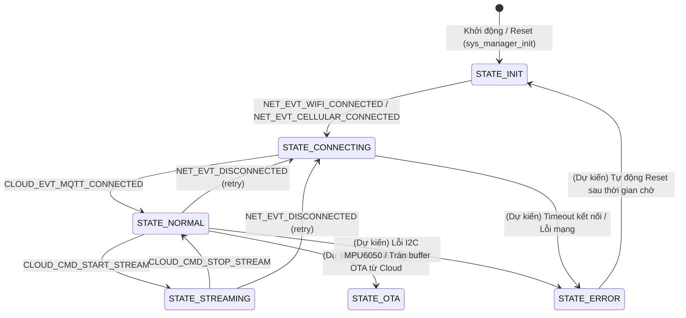

# 🧠 Component: sys_manager (System Finite State Machine)

> **Mục đích**: Hạt nhân điều phối trung tâm của toàn bộ thiết bị. Quản lý Máy trạng thái hữu hạn (FSM) và phân phối các sự kiện (Event Loop) giữa các dịch vụ.
> **Cập nhật cuối (Timestamp)**: 2026-06-17
> **Trạng thái**: Hoạt động ổn định (Phase 1 Skeleton)

---

## 1. TỔNG QUAN KIẾN TRÚC
`sys_manager` sinh ra để giải quyết vấn đề **khớp nối lỏng (Loose Coupling)** giữa các component. Thay vì các service gọi trực tiếp hàm của nhau (gây phụ thuộc chéo), các service sẽ giao tiếp bất đồng bộ qua **Default Event Loop** của ESP-IDF do `sys_manager` cấu hình.

```
┌──────────────┐             Phát Event             ┌─────────────────┐
│  svc_network │ ─────────────────────────────────> │   sys_manager   │
└──────────────┘                                    │  (Central FSM)  │
                                                    └─────────────────┘
                                                             │
┌──────────────┐           Cập nhật State            │
│   svc_imu    │ <───────────────────────────────────┘
└──────────────┘
```

---

## 2. ĐẶC TẢ MÁY TRẠNG THÁI (SYSTEM STATES)
Hệ thống di chuyển qua các trạng thái sau tùy thuộc vào điều kiện ngoại vi và kết nối mạng:

| Trạng thái | Ý nghĩa |
| :--- | :--- |
| **`STATE_INIT`** | Khởi tạo phần cứng (I2C, GPIO, NVS, bộ lọc). Đây là trạng thái mặc định lúc khởi động. |
| **`STATE_CONNECTING`** | Dịch vụ mạng đang cố gắng bắt sóng WiFi / kết nối LTE và thiết lập kết nối tới MQTT Broker. |
| **`STATE_NORMAL`** | Hệ thống hoạt động bình thường, đo lường cảm biến IMU nội bộ, chạy thuật toán đếm bước chân cục bộ, **không** truyền dữ liệu thô liên tục (tiết kiệm pin). |
| **`STATE_STREAMING`** | Chế độ truyền dữ liệu thô (Phase 1 Data Collection). Dữ liệu 100Hz từ IMU được gom nhóm (Batch) và gửi liên tục qua MQTT. |
| **`STATE_OTA`** | Đang tiến hành cập nhật chương trình từ xa thông qua mạng. |
| **`STATE_ERROR`** | Phát hiện lỗi phần cứng nghiêm trọng hoặc mất kết nối quá lâu. Thiết bị phát tín hiệu cảnh báo hoặc tự động khởi động lại (Reboot). |

### Sơ đồ chuyển trạng thái (State Transition Diagram)

Sơ đồ dưới đây phân biệt rõ **(A) các cạnh đã hiện thực trong code** (`sys_manager_event_handler`) và **(B) các cạnh còn ở dạng kế hoạch (dự kiến)** chưa được code xử lý.



> **Ghi chú về mức độ hiện thực** (đối chiếu `sys_manager.c`):
> *   **(A) Đã hiện thực**: handler nội bộ chỉ xử lý các event sau và chuyển state tương ứng — `NET_EVT_WIFI_CONNECTED` / `NET_EVT_CELLULAR_CONNECTED` → `STATE_CONNECTING`; `NET_EVT_DISCONNECTED` → `STATE_CONNECTING` (retry); `CLOUD_EVT_MQTT_CONNECTED` → `STATE_NORMAL`; `CLOUD_CMD_START_STREAM` → `STATE_STREAMING`; `CLOUD_CMD_STOP_STREAM` → `STATE_NORMAL`. Lưu ý: handler không ràng buộc state nguồn, nên về bản chất *bất kỳ* state nào đang chạy cũng có thể chuyển về `STATE_CONNECTING` khi nhận event mạng.
> *   **(B) Dự kiến (chưa code)**: các cạnh chuyển sang `STATE_OTA`, `STATE_ERROR` và `STATE_ERROR` → `STATE_INIT` mới chỉ là kế hoạch; hiện chưa có event/logic nào trong `sys_manager.c` kích hoạt chúng.

---

## 3. KHAI BÁO EVENT LOOP & SỰ KIỆN

Các Event Base và ID được định nghĩa giúp các module đăng ký và phát đi các sự kiện đặc thù:

### 3.1 Event Bases
*   `SYS_EVENT`: Các sự kiện quản trị hệ thống.
*   `NET_EVENT`: Các sự kiện kết nối lớp vật lý (WiFi, Cellular).
*   `CLOUD_EVENT`: Các sự kiện giao tiếp đám mây (MQTT, Commands).
*   `IMU_EVENT`: Các sự kiện cảm biến dữ liệu vật lý.
*   `AI_EVENT`: Sự kiện phân tích cục bộ từ mô hình suy luận.

### 3.2 Event IDs chi tiết
```c
// SYS_EVENT
SYS_EVT_READY               // Toàn bộ hệ thống sẵn sàng hoạt động
SYS_EVT_ENTER_STREAM_MODE   // Yêu cầu chuyển sang chế độ Stream dữ liệu
SYS_EVT_ENTER_NORMAL_MODE   // Yêu cầu chuyển về chế độ bình thường

// NET_EVENT
NET_EVT_WIFI_CONNECTED      // Đã kết nối WiFi và nhận được IP
NET_EVT_CELLULAR_CONNECTED  // Đã kết nối 4G LTE thành công
NET_EVT_DISCONNECTED        // Mất kết nối mạng vật lý

// CLOUD_EVENT
CLOUD_EVT_MQTT_CONNECTED    // Kết nối thành công tới MQTT Broker
CLOUD_CMD_START_STREAM      // Lệnh từ server yêu cầu bật stream IMU raw
CLOUD_CMD_STOP_STREAM       // Lệnh từ server yêu cầu tắt stream IMU raw

// IMU_EVENT
IMU_EVT_BATCH_READY         // Enum vẫn được giữ trong header để tương thích, hiện KHÔNG dùng (đã chuyển sang FreeRTOS Queue để tránh nghẽn Event Loop)
IMU_EVT_WINDOW_READY        // Đã cập nhật xong sliding window 100 mẫu

// AI_EVENT
AI_EVT_FALL_DETECTED        // Phát hiện người dùng bị té ngã (Post-impact Fall)
```

---

## 4. HƯỚNG DẪN SỬ DỤNG API
Các hàm công bố trong [sys_manager.h](include/sys_manager.h):

### 4.1 Khởi tạo FSM
```c
void sys_manager_init(void);
```
Hàm này thực hiện ba việc:
*   Khởi tạo Default Event Loop của ESP-IDF (bỏ qua nếu loop đã tồn tại — `ESP_ERR_INVALID_STATE`).
*   **Tự đăng ký handler nội bộ** (`sys_manager_event_handler`) cho `NET_EVENT` và `CLOUD_EVENT` (với `ESP_EVENT_ANY_ID`). Nhờ vậy `sys_manager` **tự động chuyển trạng thái** theo các event mạng/cloud nhận được mà không cần component khác gọi `sys_manager_set_state` thủ công (xem các cạnh "(A) Đã hiện thực" ở Mục 2).
*   Đặt FSM về trạng thái `STATE_INIT`.

### 4.2 Lấy và Thiết lập Trạng thái FSM
```c
system_state_t sys_manager_get_state(void);
void sys_manager_set_state(system_state_t new_state);
```
*   `sys_manager_set_state` ghi log chuyển đổi trạng thái dưới dạng **giá trị số nguyên của enum**: `FSM State Transition: %d -> %d` (ví dụ `0 -> 1`), **không** in tên trạng thái dạng chữ. Sau đó cập nhật trạng thái mới. Nếu trạng thái mới trùng trạng thái hiện tại, hàm trả về ngay (không log, tránh nhiễu).

---

## 5. VÍ DỤ TÍCH HỢP TRONG CODE

### 5.1 Đăng ký lắng nghe sự kiện (trong app_main hoặc service khác)
```c
static void network_event_handler(void* arg, esp_event_base_t event_base, int32_t event_id, void* event_data) {
    if (event_base == NET_EVENT && event_id == NET_EVT_WIFI_CONNECTED) {
        ESP_LOGI("APP", "Mạng đã kết nối. Cập nhật FSM sang CONNECTING...");
        sys_manager_set_state(STATE_CONNECTING);
    }
}

// Đăng ký handler
esp_event_handler_register(NET_EVENT, NET_EVT_WIFI_CONNECTED, &network_event_handler, NULL);
```

### 5.2 Phát đi một sự kiện khi xử lý thành công
```c
// Khi WiFi kết nối thành công trong svc_network
esp_event_post(NET_EVENT, NET_EVT_WIFI_CONNECTED, NULL, 0, portMAX_DELAY);
```

## Enum & Sự Kiện Mở Rộng (Phase 4)
Đã bổ sung cơ sở sự kiện `AI_EVENT`:
```c
ESP_EVENT_DECLARE_BASE(AI_EVENT);

typedef enum {
    AI_EVT_FALL_DETECTED
} ai_event_id_t;
```
Sự kiện này được phát đi từ `svc_ai` và được `svc_cloud` lắng nghe để chớp nhoáng gửi bản tin MQTT cứu hộ.
